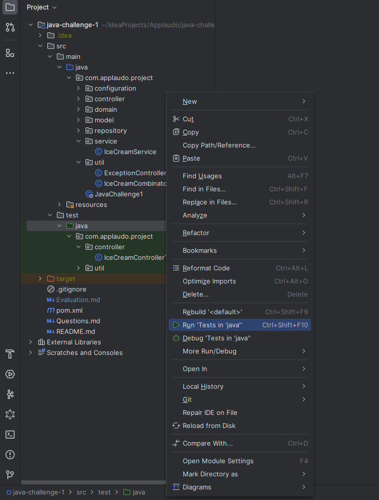

# Java Interview Challenges

Spring Boot REST API challenge. Estimated time (1.0 hours)

# _Recommendations_ (READ, READ, READ)

- Read "README.md" complete
- Focus on the first 2 endpoints and solve the easy part
- You already have data "data.sql"
- Use the "ControllerAdvice" when is posible (you already have an exception ```IceCreamNotFoundException.class```)
- The project have test (but you can create some test)
- Copy the text from README into the class as a comment to make easy to code the logic
- To scale a BigDecimal use ```setScale(2, RoundingMode.CEILING);```
- Validate inputs using Java Validation API
- You can use the Debugger
- Field "percentage" is a double,
    - for 60% you get 60
    - for 65.8% you get 65.8

## Data:

Example of a Ice Cream data JSON object:

```json
{
  "id": 1,
  "name": "Chocolate",
  "cost": 3
}
```

## Problem

When the ice creams are combined, the price of the most expensive ice cream is taken and used as a base, then the
percentage of the price of said flavor is added for each flavor

```
- Strawberry Ice cream cost = 3
- Chocolate ice cream cost = 5
- Vanilla ice cream cost = 2
- Combination = 60%
```

## Solution

The highest price is chocolate ice cream (Base price = 5) and 60% of the price of the other flavors is added.

```
Result = 5 + (3 * 0.6) + (2 * 0.6) = 8
```

The name of the combined ice cream is generated using the flavors of the other ice creams, where the order is given by
the price from highest to lowest.

```
Name = Chocolate, Strawberry and Vanilla Ice Cream
```

If you found 2 or more Ice cream with the same price, you have to order using the name

## Requirements:

The `REST` service must expose the `/api` endpoint, which allows get and combine ice creams, in case of error have to
return APIError class using BadRequest code

Logic to create combination into IceCreamCombinator.class

GET request to `/api/ice-cream/{id}`:

- returns a record (DTO) with the given id
- if the matching record exists, the response code is 200 and the response body is the matching object
- if there is no record in the collection with the given id, the response code is 404

POST request to `/api/ice-cream/combine`:

- expect a CombineIceCreamRequest class as body
    - See, [Problem](#Problem) and [Solution](#Solution)
    - "iceCreams" field size have to be 1 or more
    - "percentage" field can't be null and have to be more than 0; could expect 60 as 60%, you have to convert to
      decimal
- return a record as Ice cream (DTO) combination with the expected value in name and cost
    - Returns a record (DTO), No need to save, id is NULL in the response

### Extra Endpoints

POST request to `/api/ice-cream`:

- creates a new Ice Cream data record
- expects a valid Ice Cream data object as its body payload, except that it does not have an id property; you can assume
  that the given object is always valid
- adds the given object to the collection and assigns a unique integer id to it
- the response code is 201 and the response body is the created record, including its unique id

GET request to `/api/ice-cream`:

- the response code is 200
- the response body is an array of matching records, ordered by their ids in increasing order
- accepts an optional query string parameter, searchName, When this parameter is present, only the records with a name
  contains (Ignore Case) value are returned.

# Notes

- Good development requires testing
- The precision to use is 2 decimal places after the point

# How to run test
- 

- Click in Java dir into test and click Run test or run using CTRL+SHIFT+F10
- 

# How to Compile

```bash
mvn clean package;
```

# How to Run

```bash
java -jar target/java-challenge-1-1.0-0.jar
```


